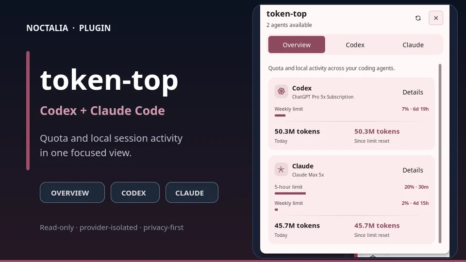
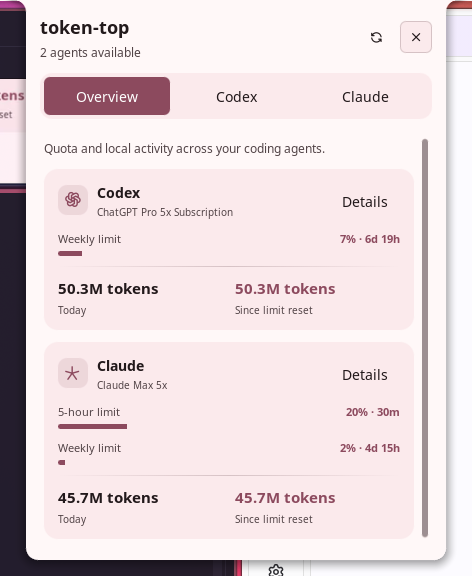

# token-top

Track Codex and Claude Code quota usage and local session activity from the Noctalia bar.

## Get started

1. Install [ripgrep](https://github.com/BurntSushi/ripgrep).
2. Sign in to at least one supported agent with `codex login` or `claude login`.
3. In Noctalia > Plugins, add `https://github.com/spinualexandru/token-top-noctalia` as a plugin source.
4. Enable `spinualexandru/token-top` and add the **token-top** widget to your bar.
5. Choose which agent appears in the bar, then click the widget for Overview, Codex, and Claude details.
